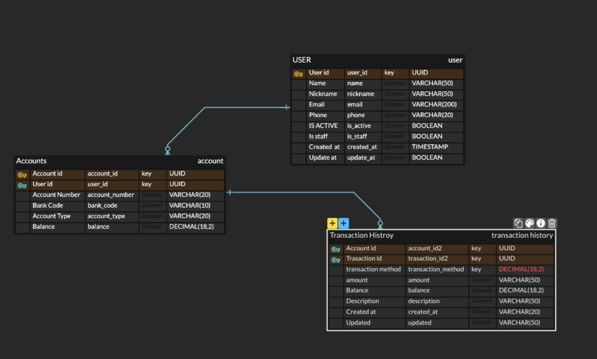

# 프로젝트 ERD

## 테이블 설명

### User
- **id**: PK, 사용자 고유 ID
- **email**: 사용자 이메일
- **password**: 암호화된 비밀번호
- **created_at**: 생성일

---

### Post
- **id**: PK, 게시물 고유 ID
- **user_id**: FK, 작성자 ID (User.id)
- **title**: 게시물 제목
- **content**: 게시물 내용
- **created_at**: 생성일

---

### Comment
- **id**: PK, 댓글 고유 ID
- **post_id**: FK, 게시물 ID (Post.id)
- **user_id**: FK, 작성자 ID (User.id)
- **content**: 댓글 내용
- **created_at**: 생성일

---

## 테이블 간 관계

- **User 1:N Post**
  - 한 명의 사용자는 여러 개의 게시물을 작성할 수 있습니다.
- **User 1:N Comment**
  - 한 명의 사용자는 여러 개의 댓글을 작성할 수 있습니다.
- **Post 1:N Comment**
  - 한 개의 게시물에는 여러 개의 댓글이 달릴 수 있습니다.

